# [Paper](https://webpages.uncc.edu/cchen62/PR_2017.pdf)
**Title**   :  Enhanced Skeleton Visualization for View Invariant human action recognition  

**Author**  : Mengyuan Liu, Hong Liu, Chen Chen

**From**   :   Key Laboratory of Machine Perception, Shenzhen Graduate School, Peking University, Beijing 100871, China    
&emsp;&emsp;&emsp;&nbsp;Center for Research in Computer Vision, University of Central Florida, Orlando, FL 32816, USA 

**Year**  :   2016  

**Journal** : Pattern Recognition 2017  

# Details
## Summary
|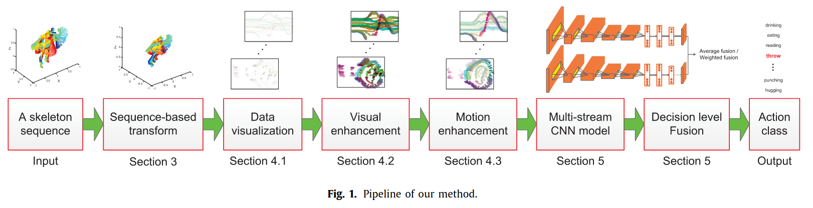|
|:--:| 
| *Pipeline of the method* |
* Sequence-based transform is applied on a skeleton sequence to make the transformed
  sequence invariant to the absolute body position and the initial body orientation
    * To eliminate the effect of noise on skeletons, we jointly use all torso joints
      from the sequence to formulate the transform matrix
* Transformed sequence is visualized as a series of color images which encode both
  spatial and temporal distributions of the skeleton joints
    * Skeleton joints are represented in 5D space [x, y, z, time_label, joint label]
    * 2 elements are used to construct the line, 3 elements are used for colours
* To enhance the local patterns of color images, we apply the mathematical
  morphology method to highlight the colored pixels
* To make color images more sensitive to motions, we develop a weighting scheme to 
  emphasize skeleton joints with salient motions

### Main Contributions
* Sequence-based view invariant transform
* Enchanced skeleton visualization method
* Weighted fusion method for multi-stream CNN fusion model

## Sequence-based View Invariant Transform
* Given a skeleton sequence *I* with *F* frames, the *n*th skeleton joint on the 
  *f*th frame is formulated as , where 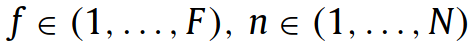, *N* denotes the total number of skeleton joints in each skeleton
* Use joint configuration in the [NTU RGB+D dataset](https://arxiv.org/pdf/1604.02808.pdf)

||
|:--:| 
| *Configuration of 25 body joints in our dataset. The labels of the joints are:  1-base of the spine, 2-middle of the spine, 3-neck, 4-head, 5-left shoulder, 6-left   elbow, 7-left wrist, 8-left hand, 9-right shoulder, 10-right elbow, 11-right wrist, 12-right hand, 13-left hip, 14-left knee, 15-left ankle, 16-left foot, 17-right hip, 18-right knee, 19-right ankle, 20-right foot, 21-spine, 22-tip of the left hand, 23-left thumb, 24-tip of the right hand, 25-right thumb* |
* 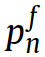 can be mapped to a point in a 5D space 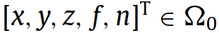
* View invariant values can be determined by 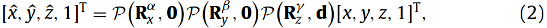
    * 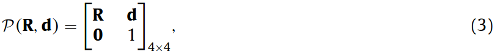 
    * **d** is a translation vector,  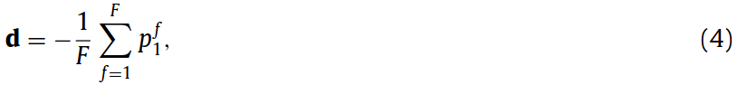 
    *  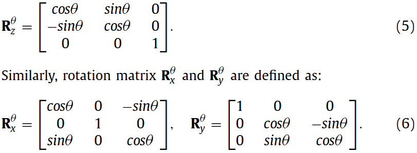 

### To find *α*, *β*, and *γ*
* 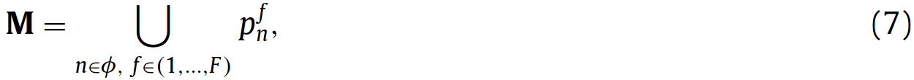

    * where 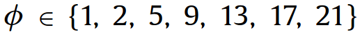 denotes the set of the seven torso joints
    Matrix **M** is the torso matrix, which consists of 7 x *F* rows and 3 columns

* |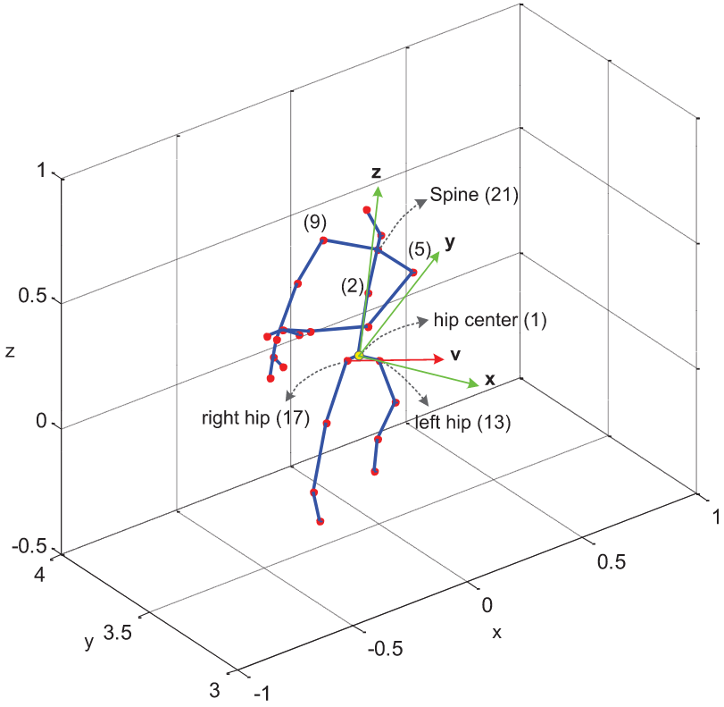|
    |:--:| 
    | *Illustration of the view invariant transform. **v** denotes the direction from "right hip" to "left hip". **x** is perpendicular to **z** and has a minimum angle with **v*** |

* **z** is the first principal component of M, which is always aligned with the longer dimension of the torso
* 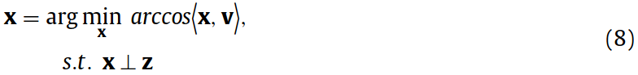

    * 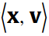 is a dot product
    * 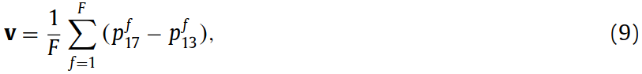
* **y** = **z** x **x**
* *α*, *β*, and *γ* can be determined by transforming **x**, **y**, **z** to [1, 0, 0]T, [0, 1, 0]T, [0, 0, 1]T using Formula 2
* 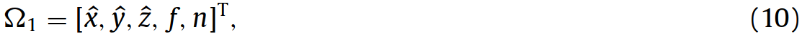

## Enhanced Skeleton Visualization
### Skeleton Visualization
* Express 5D space as 2D coordinate space and 3D color space

|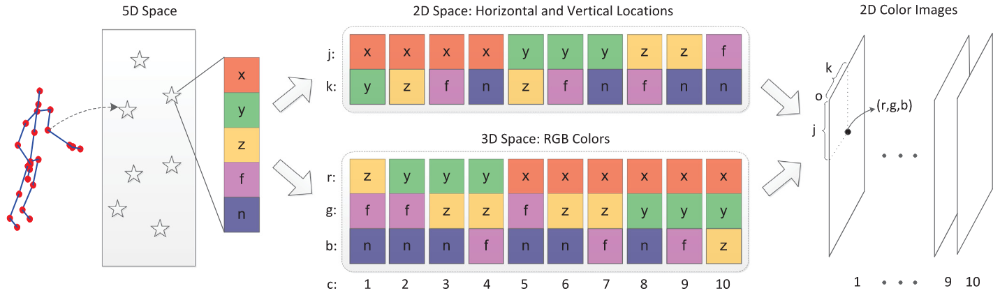|
|:--:| 
| *Pipeline of the data visualization method* |
* 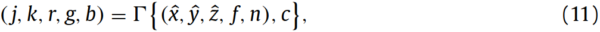
    
    * *c* indicates that function returns the *c*th type of ranking
    * 10 ranking in total ( 10 = 5**C**2 )
* ***r**, **g**, **b*** are normalized to [0, 255]
* 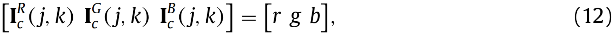

#### Why 5**C**2 instead of 5**P**5?
* High memory and computation cost
* May contain redundant / repeated information  
    * 2 images share the same color space (*z*, *f*, *n*) while their coordinate spaces are respectively denoted as (*x*, *y*) and (*y*, *x*), which are transformable by rotating 90 degrees
    * 2 images share the same coordinate space (*x*, *y*) while their color space are respectively denoted as (*z*, *f*, *n*) and (*z*, *n*, *f*), which have the same shapes and slight different in colors

|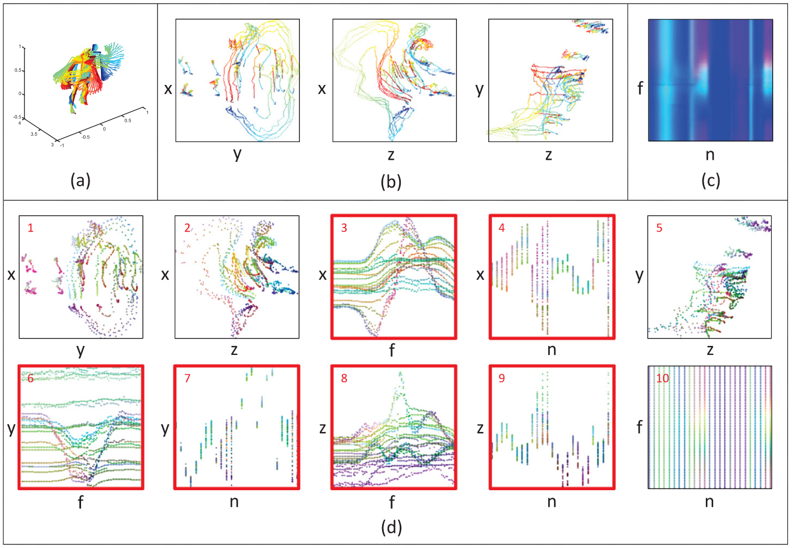|
|:--:| 
| *Illustration of color images generated by different data visualization methods. (a) shows skeletons of an action “throw”. (b), (c) and (d), respectively shows color images generated by [20](https://arxiv.org/pdf/1611.02447.pdf), [21](https://sci-hub.tw/https://ieeexplore.ieee.org/abstract/document/7486569) and their method* |

### Visual Enchancement
|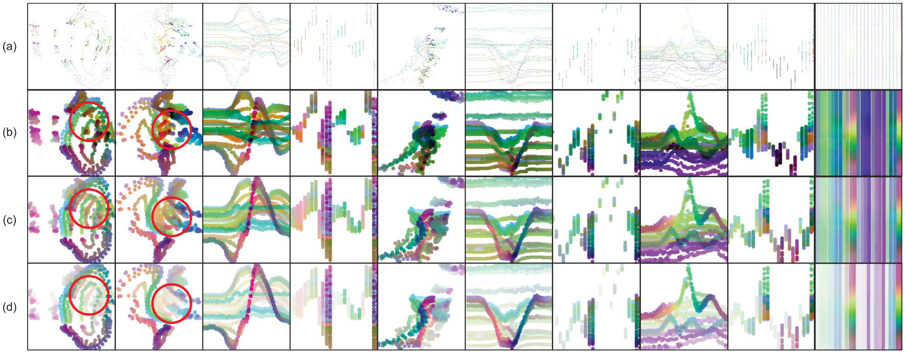|
|:--:| 
| *A skeleton sequence “throw” is visualized as color images. (a) shows the initially obtained color images.(b) is processed by visual enhancement.(c) and (d) are processed by both visual enhancement and motion enhancement, where ρ = 0.5 for (c) and ρ = 1 for (d)* |
* Apply erosion to the images
* Elliptic structuring element of radius 5

### Motion Enchancement
* Given , estimate its motion energy by: 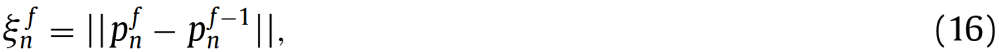
    
    * where *f* > 1 and operator || · || calculates tge Euclidean metric
* The accumulated motion energy of  is defined as:
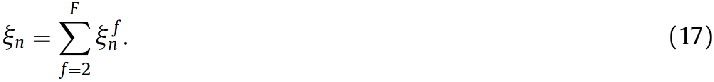

* Weight of :  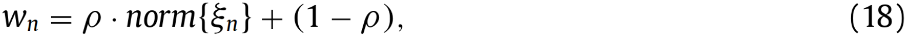
    * where 0 ≤ *ρ* ≤ 1 and *norm* normalizes ξn to [0, 1]
* 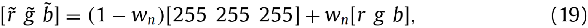 

    * pixel with larger *wn* will keep most of its original color, and pixel with smaller *wn* will fade into white (same as background)

|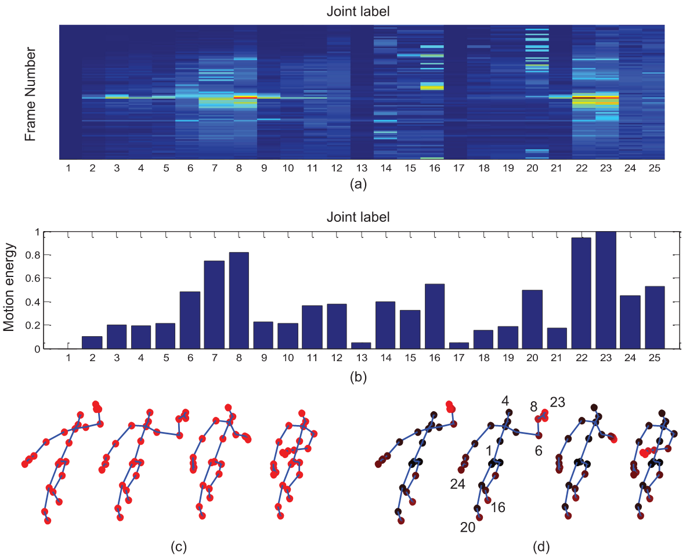|
|:--:| 
| *Illustration of weighing skeleton joints according to the motion energies. In (a), the nth row and fth column shows the motion energy of skeleton joint pfn. Note that the joint label indices indicate joints shown in figure above. In (b), the nth bar shows the accumulated motion energy of the nth skeleton joint. (c) shows several snaps from a skeleton sequence “throw”. (d) shows several weighted snaps, where skeleton joints with larger weights are colored in brighter red* |

## Multi-stream CNN Fusion
|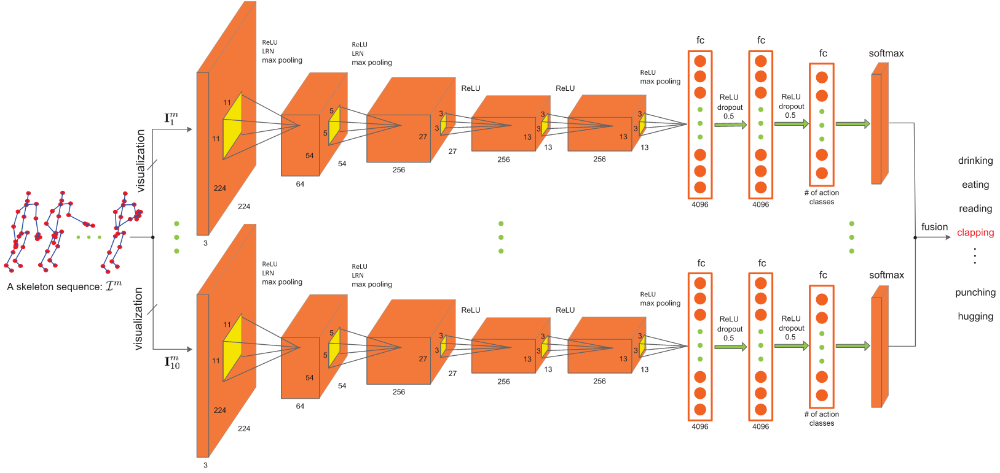|
|:--:| 
| *Proposed skeleton-based action recognition using multi-stream CNN* |
* 10 modified AlexNet
* Mean Subtraction for all input images
* 2 score fusion methods:  
    * Average fusion  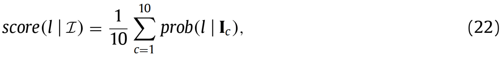
    * Weighted fusion  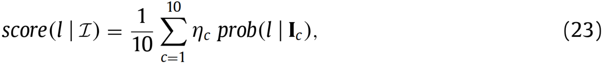  
    where *ηc* is 0 or 1, indicating whether the *c*th CNN is selected or not

## Experiments
* Evaluated on:
    * [Northwestern-UCLA](https://users.eecs.northwestern.edu/~jwa368/my_data.html) ([paper](http://wangjiangb.github.io/pdfs/crossview.pdf))
    * [UWA3DII](http://staffhome.ecm.uwa.edu.au/~00053650/databases.html) ([paper](https://arxiv.org/pdf/1409.6813.pdf))
    * [NTU RGB+D](http://rose1.ntu.edu.sg/datasets/actionrecognition.asp) ([paper](https://arxiv.org/pdf/1604.02808.pdf))
    * [MSRC-12](https://www.microsoft.com/en-us/download/details.aspx?id=52283) ([paper](http://www.nowozin.net/sebastian/papers/fothergill2012gestures.pdf))
    
### Training
* Mini-batch SGD with momentum of 0.9, and weight decay of 0.00005
* Learning rate of 0.001
* Batch size 50
* Max training cycle 200

| | Original | Synthesized | Pretrained (ImageNet) |
:-: | :-: | :-: | :-: 
Weight random intialized from [0, 0.01] | :heavy_check_mark: |  :heavy_check_mark: | Third *fc* layer only
Random Mirror | |  :heavy_check_mark: |

|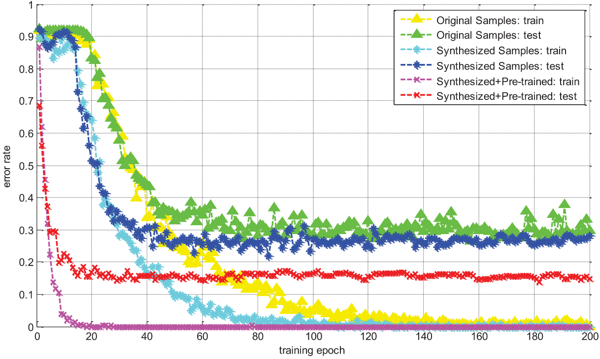|
|:--:| 
| *Convergence curves on the MSRC-12 dataset. The first type of color image is used as input for CNN. Error rate almost converges when the training epoch equals to 200* |

### Northwestern-UCLA
* 1494 sequences, 10 action categories
* First 2 cameras for training, and the third camera for testing

|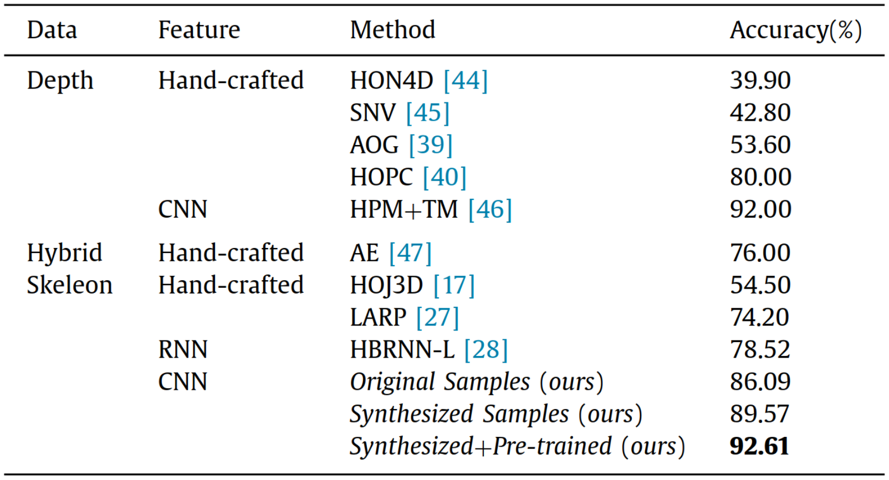|
|:--:| 
| *Results on the Northwestern-UCLA dataset* |

### UWA3DII
* 30 human actions performed 4 times by 10 subjects
* Challenging dataset due to:
    * Varying viewpoints
    * Self-occlusion
    * High similarity among actions. E.g. "drinking" and "answering phone" have slightly different location of the hand
* 2 views for training, and the other 2 for testing

|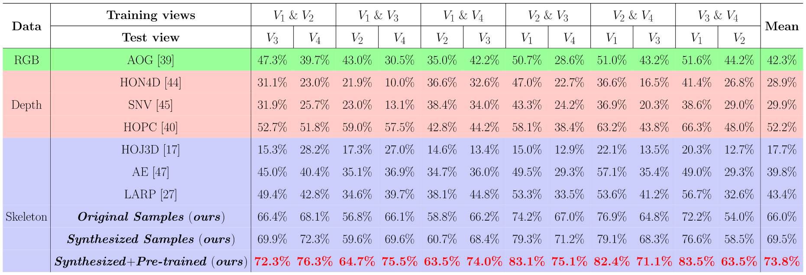|
|:--:| 
| *Results on the UWA3DII dataset* |

### NTU RGB+D
* 60 actions performed by 40 subjects from various views, generating 56880 skeleton sequences
* Contains noisy skeleton joints
* 20 subjects for training, 20 for testing
* Training and testing sets have 37,920 samples and 18,960 samples respectively
* Camera 2 and 3 for training, camera 1 for testing

|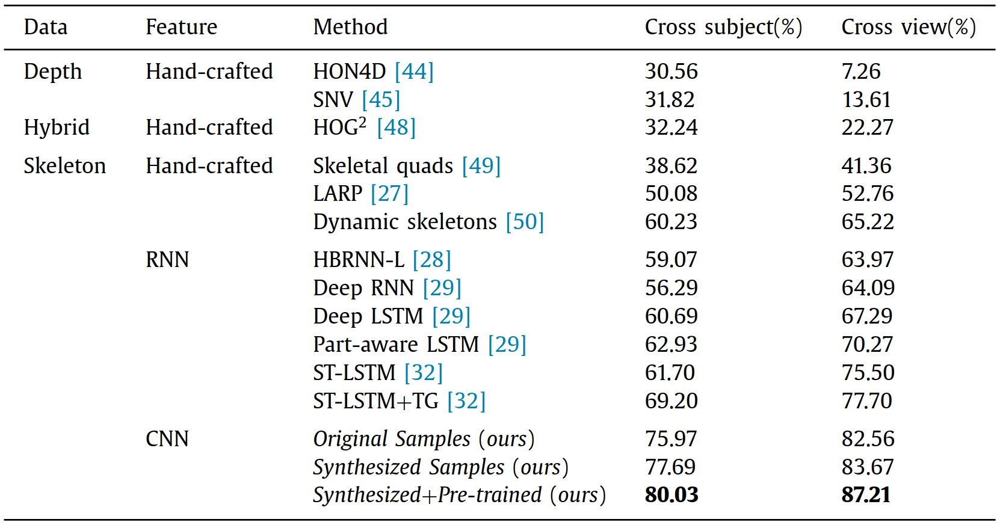|
|:--:| 
| *Results on the NTU RGB+D dataset* |

### MSRC-12
* 594 sequences, 719,359 frames, collected from 30 people performing 12 gestures
* Single-view dataset, so sequence-based tranform method os not used
* Odd subjects for training, even subjects for testing

|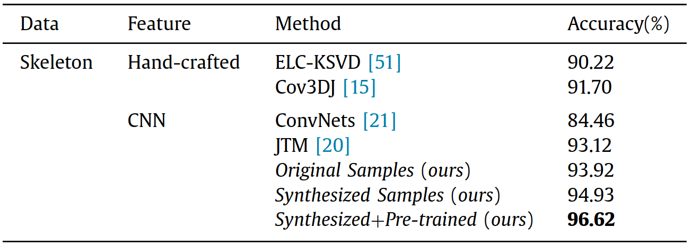|
|:--:| 
| *Results on the MSRC-12 dataset* |

### Evaluation of Individual Components
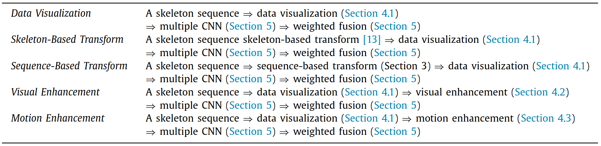|
|:--:| 
| *Results on the MSRC-12 dataset [[13](https://www.microsoft.com/en-us/research/wp-content/uploads/2016/02/BodyPartRecognition.pdf)]* |

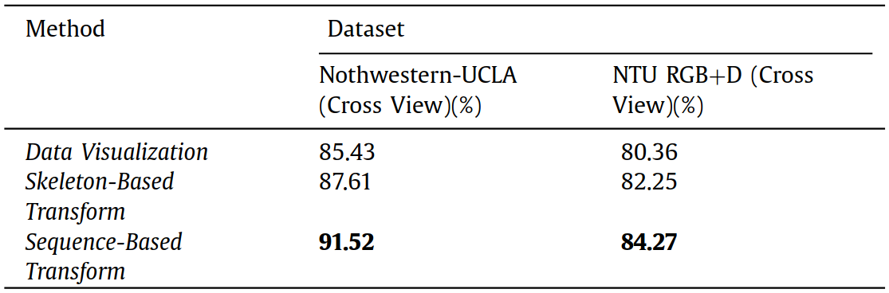|
|:--:| 
| *Evaluation of view invariant transform* |

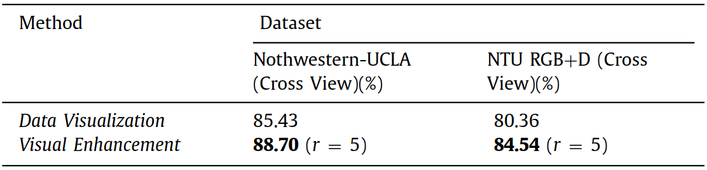|
|:--:| 
| *Evaluation of visual enhancement* |

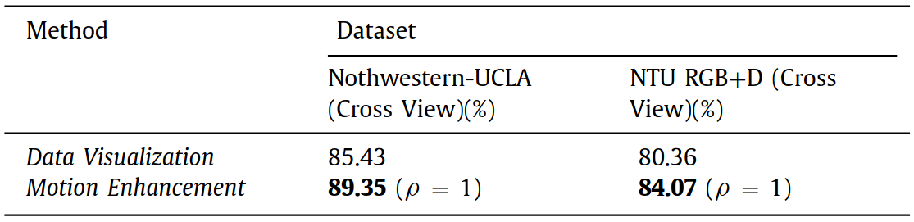|
|:--:| 
| *Evaluation of motion enhancement* |

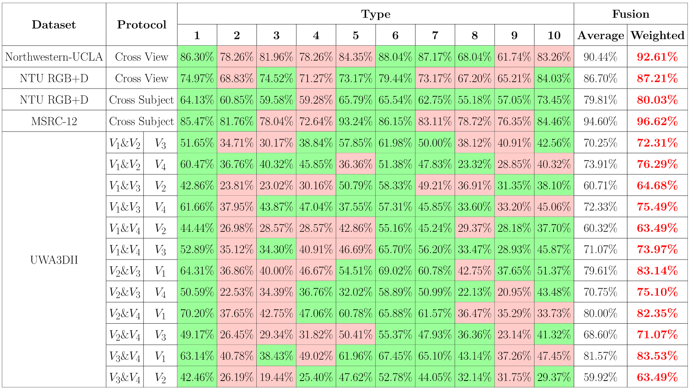|
|:--:| 
| *Evaluation of average fusion and weighted fusion. The types of color images colored in green are selected to generate the weighted fusion results* |

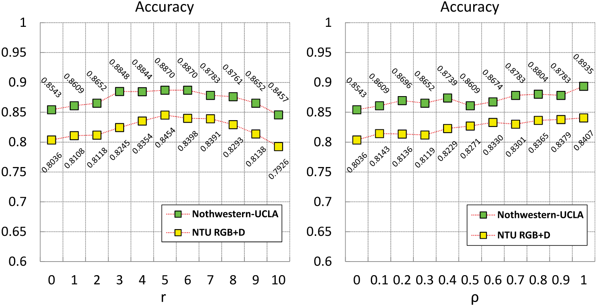|
|:--:| 
| *Evaluation of parameter r (radius of the structuring element **E**) and ρ. Left figure shows the accuracy of Visual Enhancement with r ranging from 0 to 10 at an interval of 1. Right figure shows the accuracy of Motion Enhancement with parameter ρ ranging from 0 to 1 at an interval of 0.1* |

### Evaluation of computation time
* GTX 1080
* Average testing time, including feature extraction and classification
    * Average fusion: 0.65s
    * Weighted fusion: 0.39s (some CNNs are not used)

