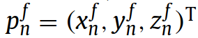
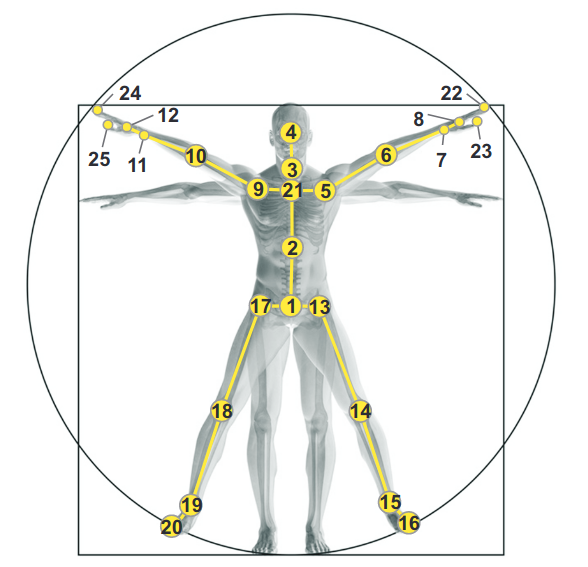

# [Paper](https://webpages.uncc.edu/cchen62/PR_2017.pdf)
**Title**   :  Enhanced Skeleton Visualization for View Invariant human action recognition  

**Author**  : Mengyuan Liu, Hong Liu, Chen Chen

**From**   :   Key Laboratory of Machine Perception, Shenzhen Graduate School, Peking University, Beijing 100871, China    
&emsp;&emsp;&emsp;&nbsp;Center for Research in Computer Vision, University of Central Florida, Orlando, FL 32816, USA 

**Year**  :   2016  

**Journal** : Pattern Recognition 2017  

# Details
## Summary
||
|:--:| 
| *Pipeline of the method* |
* Sequence-based transform is applied on a skeleton sequence to make the transformed
  sequence invariant to the absolute body position and the initial body orientation
    * To eliminate the effect of noise on skeletons, we jointly use all torso joints
      from the sequence to formulate the transform matrix
* Transformed sequence is visualized as a series of color images which encode both
  spatial and temporal distributions of the skeleton joints
    * Skeleton joints are represented in 5D space [x, y, z, time_label, joint label]
    * 2 elements are used to construct the line, 3 elements are used for colours
* To enhance the local patterns of color images, we apply the mathematical
  morphology method to highlight the colored pixels
* To make color images more sensitive to motions, we develop a weighting scheme to 
  emphasize skeleton joints with salient motions

### Main Contributions
* Sequence-based view invariant transform
* Enchanced skeleton visualization method
* Weighted fusion method for multi-stream CNN fusion model

## Sequence-based View Invariant Transform
* Given a skeleton sequence *I* with *F* frames, the *n*th skeleton joint on the 
  *f*th frame is formulated as , where , *N* denotes the total number of skeleton joints in each skeleton
* Use joint configuration in the [NTU RGB+D dataset](https://arxiv.org/pdf/1604.02808.pdf)

||
|:--:| 
| *Configuration of 25 body joints in our dataset. The labels of the joints are:  1-base of the spine, 2-middle of the spine, 3-neck, 4-head, 5-left shoulder, 6-left   elbow, 7-left wrist, 8-left hand, 9-right shoulder, 10-right elbow, 11-right wrist, 12-right hand, 13-left hip, 14-left knee, 15-left ankle, 16-left foot, 17-right hip, 18-right knee, 19-right ankle, 20-right foot, 21-spine, 22-tip of the left hand, 23-left thumb, 24-tip of the right hand, 25-right thumb* |
*  can be mapped to a point in a 5D space 
* View invariant values can be determined by 
    *  
    * **d** is a translation vector,   
    *   

### To find Alpha, Beta, and Gamma
*

## Data Visualization method
||
|:--:| 
| *Pipeline of the data visualization method* |
* 
||
|:--:| 
| *Illustration of color images generated by different data visualization methods. (a) shows skeletons of an action “throw”. (b), (c) and (d), respectively shows color images generated by [20](https://arxiv.org/pdf/1611.02447.pdf), [21](https://sci-hub.tw/https://ieeexplore.ieee.org/abstract/document/7486569) and their method* |

## Visual Enchancement
||
|:--:| 
| *A skeleton sequence “throw” is visualized as color images. (a) shows the initially obtained color images.(b) is processed by visual enhancement.(c) and (d) are processed by both visual enhancement and motion enhancement, where ρ = 0.5 for (c) and ρ = 1 for (d)* |

## Multi-stream CNN Fusion
