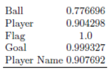

# [Paper](https://airccj.org/CSCP/vol8/csit88509.pdf)
**Title**   :   SOCCER EVENT DETECTION  

**Author**  :   Abdullah Khan, Beatrice Lazzerini, Gaetano Calabrese, Luciano Serafini  

**From**   :   Department of Information Engineering, University of Pisa, Pisa, Italy,  
&emsp;&emsp;&emsp;&nbsp;Department of Information Engineering, University of Florence, Florence, Italy,  
&emsp;&emsp;&emsp;&nbsp;Fondazione Bruno Kessler, Trento, Italy  

**Year**  :   2018  

**Event** :  Conference: 4th International Conference on Image Processing and Pattern Recognition (IPPR 2018)

# Details
## Summary
||
|:--:| 
| *Block diagram of the proposed architecture* |
* Define the target events
* Get bounding boxes using [SSD](https://arxiv.org/pdf/1512.02325.pdf)
* Using specific threshold, filter out objects not needed to define the action
* Event Detection by matching the scenes to the defined events

## Event Definition Templates
* Define simple event type as follows:

    *   
 
            
            

                <i>ID</i> is the indentifier; <i>seType</i> is the event type, e.g. "<i>throwing the ball</i>"; <i>t</i> is the time instant in which the event occurs; <i>rolen</i> are roles that different objects play, e.g. "<i>throwing_player</i>" and "<i>throwed_ball</i>"; <i>oTypen</i> are the object IDs who are playing those roles
            

        

* Complex events are built by combining events (simple and/or complex) with logical and/or temporal operators

    * Logical Complex Events
        *   
 
                
                

                    <i>L</i> is the set of lower-level simple or complex events <i>en</i>joined by logical operators <i>op (i.e. AND, OR, NOT)</i>
                

            

    * Temporal Complex Events

        *   
 
                
                

                    <i>L</i> is the sequence of lower-level simple or complex events <i>en</i>that must occur in the order
                

            

## Event Used for Experiments
* Ball possession Event
    *   
 
            
            

                <i>D</i> is the distance between player <i>pi</i> and ball <i>b</i> at time <i>t</i>
            

        

    * Event starts when a player interacts with the ball and ends when he can no longer interacts with the ball
    * Formal Definition:  the  event  occurs  when  the  distance between a player and the ball is below a threshold value and that player is the nearest to the ball, and after interaction, the distance between the player and the ball is very low for an appropriate number of consecutive frames

* Kicking the ball Event
    *   
 
            
        

    * Initially, the distance between the ball and the player has to be low for a few frames. Then, the distance needs to increase in an appropriate number of the subsequent frames until the player is no longer able to interact with the ball

## Event Detections
* Inputs are the bounding boxes from the [SSD](https://arxiv.org/pdf/1512.02325.pdf)
* Detect simple and low-level complex events first based on the rules defined for each event category and stores those events in the memory
* Higher-level complex events are detected by applying logical and/or temporal operators on the detected (simple and low-level) complex events

# Experiment Results
Experiment on 5 minutes short videos, consisting of about 7.5k frames

## SSD
|||
|:--:|:--:| 
| *Objects used to train and test SSD* | *Average Precision of SSD* |

## Event Detection
||
|:--:| 
| *Event Detection results* |

* 1 missed 'ball possesion event' due to 2 players being close to each other, so it
  hard to recognize possession
* Heuristically chosen, the distance between the ball and the player has to be low 
  for 5 frames
* Missed 'kicking the ball' events due to fast kicking sequence, such as one touch
  pass

# Limitations
* It's difficult to include all cases, some special cases might not be detectable
* The use of thresholds and rules make the definitions rigid
* Detection might be too late, not eal-time. In cases like [TCE](#Event-Definition-Templates), 
  all required events have to be detected first before a TCE is detected. This 
  means that the events might have ended when it is detected
* Low number of events and small dataset shown in experiment results