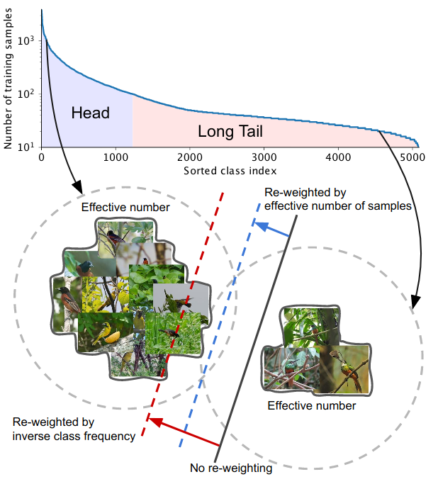

# [Paper](http://openaccess.thecvf.com/content_CVPR_2019/papers/Cui_Class-Balanced_Loss_Based_on_Effective_Number_of_Samples_CVPR_2019_paper.pdf) [[code](https://github.com/richardaecn/class-balanced-loss)]
**Title**   :   Class-Balanced Loss Based on Effective Number of Samples

**Author**  : Yin Cui1,2, Menglin Jia1, Tsung-Yi Lin3, Yang Song4, Serge Belongie1,2

**From**   :   1Cornell University, 2Cornell Tech, 3Google Brain, 4Alphabet Inc

**Year**  :   2019

# Details
## Summary
||
|:--:| 
| *Fig. 1: Two classes, one from the head and one from the tail ofa long-tailed dataset (iNaturalist 2017 [41] in this example), havedrastically different number of samples. Models trained on thesesamples are biased toward dominant classes (black solid line). Re-weighing the loss by inverse class frequency usually yields poorperformance (red dashed line) on real-world data with high classimbalance. We propose a theoretical framework to quantify theeffective number of samples by taking data overlap into consider-ation. A class-balanced term is designed to re-weight the loss byinverse effective number of samples. We show in experiments thatthe performance of a model can be improved when trained withthe proposed class-balanced loss (blue dashed line)* |
* Re-weighing the loss by inverse class frequency is not the optimal way as the feature maps from different classes might overlap each other
* Propose re-weighing the loss by using the effective number of samples
* Effective number of samples can be imagined as the actual volume that will be covered by *n* samples where the total volume *N* is represented by total samples

##  Effective Number of Samples 
* Given a class, denote the set of all possible data in thefeature space of this class as *S*. We assume the volume of *S* is *N* and *N* ≥ 1. Denote each sample as a subset of *S* that has the unit volume of 1 and may overlap with other samples
* (Effective Number) *En = (1 - β𝑛) / (1 - β)*, where *β = (N - 1) / N*
* (Asymptotic Properties) *En = 1 if β = 0 (N = 1); En ⟶ n if β ⟶ 1 (N ⟶ ∞)*
    * The asymptotic property ofEnshows that when *N* islarge, the effective number of samples is same as the number of samples *n*. In this scenario, we think the numberof unique prototypes *N* is large, thus there is no data overlap and every sample is unique
    * If *N* = 1, this means that we believe there exist a single prototype so that all the data in this class can be represented by this prototype via data augmentation, transformations,etc

##  Class Balance Loss
* JCD feature is location viewpoint invariant, but it does not contain global motion information (Fig.1 (c))
* Idea is inspired by [SlowFast](https://arxiv.org/pdf/1812.03982.pdf)
* Two-scale motions can be generated by the following equation: 
    * where *M* denotes the slow motion and fast motion at frame *k* respectively
    * *Sk+1* and *Sk+2* are behind *Sk* for one frame and two frames respectively
* Corresponding to *S[1,...,K]*, we have *M[1,...,K−1]* slow and *M[1,...,K/2−1]* fast
* Flatten to 1D vector
* To match JCD feature, perform linear interpolation to resize *M[1,...,K−1]* slow and *M[1,...,K/2−1]* fast to *M[1,...,K]* slow and *M[1,...,K/2]* fast

##  Modeling Joint Correlations by an Embedding
* The correlation of joints is automatically learned through the embedding as depicted in figure 2
* As another benefit, the embedding process also reduces the effect of skeleton noise

## Experiments
* Train and test on 2 datasets:
    * [SHREC17](https://shapenet.cs.stanford.edu/shrec17/)
    * [JHMDB](http://jhmdb.is.tue.mpg.de/)

||
|:--:| 
| *Table I: Properties of experimental datasets* |

## Training Details
* Adam (*β*1 = 0.9, *β*2 = 0.999)
* Annealing learning rate that drops from 1e-3 to 1e−5

## SHREC17
||
|:--:| 
| *TABLE II: Results on SHREC (Using 3D skeletons only)* |

## JHMDB
||
|:--:| 
| *TABLE III: Results on JHMDB (Using 2D skeletons only)* |
